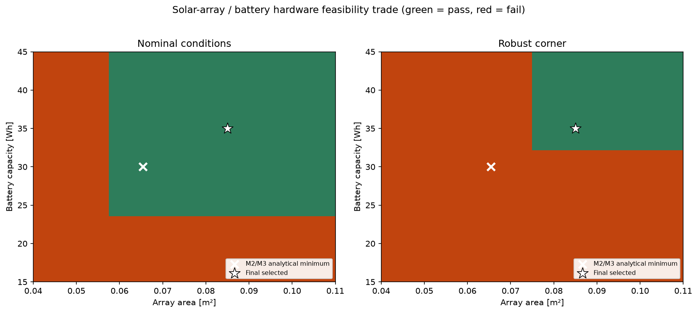
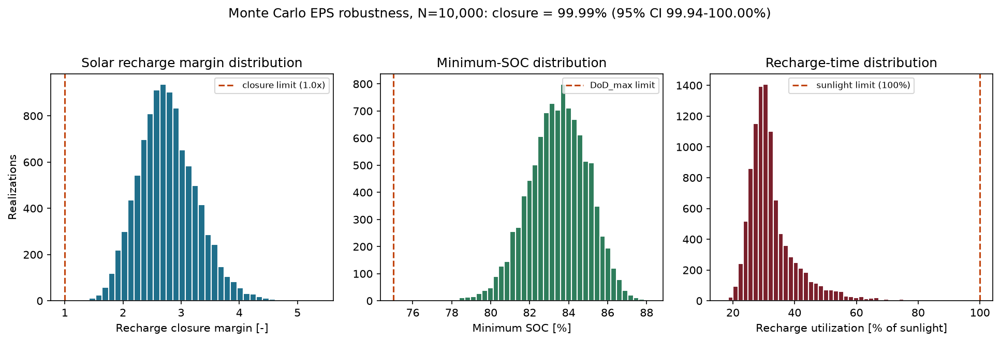

# GNC-05 — Smallsat Power Budget

A coding-focused spacecraft electrical power system (EPS) sizing
project. Converts mission operating modes, eclipse fraction, and duty
cycle into a defensible **power budget, solar-array requirement,
battery requirement, and an integrated robustness case** for that
design — built as a reusable, tested Python package rather than a
one-off notebook.

## 1. Project objective

> Given a spacecraft's operating-mode schedule and orbit geometry,
> derive a physically traceable power budget, size the solar array and
> battery from first principles, and show that the resulting design
> remains adequate under realistic mission-growth and modeling
> uncertainty.

Every number in this repository is either computed from the model or
stated explicitly as a representative engineering assumption — no
commercial hardware is selected or implied anywhere.

## 2. Final EPS recommendation

| | Analytical minimum | **Final selected** |
|---|---:|---:|
| Solar-array area | 0.0654 m² | **0.085 m²** |
| Array EOL electrical output | 19.30 W | **25.07 W** |
| Battery BOL nameplate capacity | 30.0 Wh | **35.0 Wh** |
| Battery EOL capacity | 24.0 Wh | **28.0 Wh** |
| Deterministic robust-corner check | **FAILS** (solar deficit + DoD exceeded) | **PASSES** |
| Monte Carlo closure probability (N=10,000) | not applicable | **99.99%** (95% CI 99.94–100.00%) |

The final design is the M2/M3 analytical minimum, escalated by the
smallest practical increment (array +30%, battery +17%, each rounded
to that milestone's own stated granularity) that closes a single,
documented, deterministic robust-design corner — not arbitrary
conservatism. See [§8](#8-integrated-robustness-milestone-4) for the
full derivation.

## 3. Key engineering findings

1. **Orbit-average power is not the array requirement.** The array
   only exists electrically during the 60.9-minute sunlight arc; the
   physically correct sunlight-only recharge equation demands **1.76×**
   naive average-power sizing.
2. **Battery sizing depends on *when* energy is consumed, not just
   total duty cycle.** Moving one fixed 600 s/10.2 W downlink pass from
   sunlight into eclipse leaves orbit-average power and total
   energy/orbit *unchanged*, while raising required battery capacity
   by **15%**.
3. **The analytical-minimum EPS design is not robust to realistic,
   simultaneous mission/hardware uncertainty.** A single deterministic
   "robust corner" (modest, ~1–2σ unfavorable shifts in load,
   duty cycle, eclipse fraction, and every EPS efficiency/degradation
   assumption) fails the 0.0654 m² / 30 Wh minimum design — via **two
   independent failure modes** (array power deficit *and* battery DoD
   exceedance) — confirming both the array and the battery genuinely
   needed to grow, not just one.
4. **The final, modestly escalated design (0.085 m² / 35 Wh) closes
   99.99% of a 10,000-realization Monte Carlo robustness campaign**
   and passes the deterministic corner with margin.

## 4. Baseline mission

Representative 3U-cubesat-class LEO Earth-observation mission — every
number is a stated engineering assumption, not a sourced commercial
hardware spec (`docs/methodology.md` §6).

| metric | value |
|---|---|
| orbit period | 94.6 min |
| eclipse fraction | 0.356 |
| orbit-average load | 8.79 W |
| peak bus load | 14.50 W |
| total energy/orbit | 13.85 Wh |
| sunlight / eclipse energy | 9.47 Wh / 4.38 Wh |

## 5. Load/energy model (Milestone 1)

A validated, full-coverage `OrbitSchedule` (no gaps/overlaps, tiles
`[0, T_orbit)` exactly) of named `Mode` objects is integrated
**analytically** — never by sampling alone — into orbit-average power,
peak power, and a sunlight/eclipse energy split that correctly handles
mode spans straddling the eclipse terminator. See
[`docs/methodology.md`](docs/methodology.md).

## 6. Solar-array sizing (Milestone 2)

The array must cover sunlight loads *and* generate enough surplus to
fully recharge whatever the eclipse arc consumed, both through lossy
conversion paths:

```
P_SA,raw = (E_sunlight/eta_sun_path + E_eclipse/eta_recharge_path) / t_sunlight
```

| Quantity | Value |
|---|---:|
| Raw required array output | **15.44 W** (1.76× naive `P_avg`) |
| Design array output (25% margin) | **19.30 W** |
| BOL / EOL usable power density | 347.1 / 295.0 W/m² |
| Required array area | **0.065 m²** |

Array area scales **exactly inversely** with cell efficiency and EOL
degradation (verified to 1e-9); payload duty is a stronger array-area
driver than communications duty (14.5 W > 10.2 W bus draw). Full
derivation: [`docs/solar_array_methodology.md`](docs/solar_array_methodology.md).

## 7. Battery sizing (Milestone 3)

The battery must supply **withdrawn** energy (after discharge-path
losses), sized against an allowable depth of discharge, an explicit
design margin, and end-of-life capacity retention — three separate,
never-conflated factors:

| Quantity | Value |
|---|---:|
| Battery withdrawal (after 95% discharge efficiency) | **4.61 Wh** |
| Allowable DoD | 25% |
| Selected design capacity | **30.0 Wh** |
| Minimum SOC over the baseline orbit | **84.6%** |
| Recharge closure | +67.2% margin |

Required capacity scales **exactly inversely** with allowable DoD.
Full derivation, including the activity-timing experiment (finding #2
above): [`docs/battery_sizing_methodology.md`](docs/battery_sizing_methodology.md).

## 8. Integrated robustness (Milestone 4)

`EPSDesign` (`src/power_budget/integrated.py`) represents the fixed,
selected hardware separately from any one mission scenario's
requirement, with four explicit, non-collapsed margins (solar energy,
array power, battery energy, recharge time) — never one ambiguous "EPS
margin," and never double-counting the design margins already baked
into the M2/M3-selected area/capacity.

**Uncertainty model.** Eleven parameters — every one already present
in M1–M3 (load level, duty cycles, eclipse fraction, cell efficiency,
array factor, PV/battery EOL degradation, path/discharge
efficiencies) — are modeled as independent, bounded-normal
distributions around their M1–M3 nominal values (representative
engineering assumptions, not calibrated flight distributions; see
[`docs/integrated_eps_methodology.md`](docs/integrated_eps_methodology.md)
§5–6).

**Monte Carlo campaign** (`src/power_budget/robustness.py`, N=10,000,
seed=42): for each realization, the schedule/orbit is rebuilt from the
sampled mission parameters and the **fixed** EPS hardware is evaluated
against it — the array/battery are never resized inside a
realization. A realization passes only if energy closure, DoD limit,
and recharge-time all pass; failures are individually attributed to
one of five distinct failure modes.

**Deterministic robust corner:** one defensible scenario (each
parameter shifted ~1–2σ unfavorably, not stacked at absolute
extremes). The 0.0654 m²/30 Wh analytical minimum **fails** it via two
independent failure modes; the escalated 0.085 m²/35 Wh final design
**passes** with margin. See the hardware trade-map figure below — the
single strongest result of this milestone.

<p align="center"></p>

<p align="center"></p>

## 9. Mission operating envelope

For the fixed final design, a 2D feasibility sweep over eclipse
fraction (0.20–0.50) and communications duty (0.5×–4.5× baseline)
shows the design remains feasible across virtually the entire
plausible envelope — infeasibility appears only where very high
eclipse fraction (>~0.46) combines with very high communications duty
(>~2.3× baseline), well outside the baseline mission's operating
point. See [`results/figures/m4_operating_envelope.png`](results/figures/m4_operating_envelope.png).

## 10. Verification / testing

- **246 tests, 246 passing.** Every milestone's tests remain green as
  later milestones are added — nothing is weakened.
- Energies/averages use exact analytic integration of piecewise-
  constant power, cross-checked against fine-grained numeric
  integration in tests.
- Every sizing equation has a corresponding scaling-law test (inverse,
  linear, or exact-ratio, to 1e-9 where applicable).
- Monte Carlo determinism, non-mutation of fixed hardware, Wilson-
  interval correctness, and convergence monotonicity are all
  regression-tested.
- A real defect (recharge-time interpolation using post-clip stored
  energy) was found and fixed during Milestone 3 development; the fix
  is documented and locked into the regression suite.

## 11. Repository structure

```
src/power_budget/       Core package
  modes.py                Operating-mode definitions (Mode, ModeSet)
  orbit.py                 Orbit period / eclipse-fraction geometry
  schedule.py               Full-coverage mode timeline over one orbit
  energy.py                  Power-profile sampling + analytic energy integration
  budget.py                   Per-mode power-budget table + orbit summary       (M1)
  solar.py                     Solar-array sizing: sunlight energy closure       (M2)
  battery.py                    Battery sizing, DoD, SOC simulation              (M3)
  integrated.py                  Fixed EPSDesign, requirement/capability, margins (M4)
  robustness.py                   Monte Carlo, sensitivity, trade maps            (M4)
tests/                   pytest suite (246 tests: unit + regression + invariants)
scripts/
  mission_baseline.py      Baseline mission definition (orbit, modes, schedule)
  run_power_budget.py      M1: runs the load analysis, writes table + figures
  size_solar_array.py      M2: sizes the solar array, writes tables + figures
  size_battery.py          M3: sizes the battery, writes tables + figures
  final_eps_study.py       M4: robustness study, final sizing, writes tables + figures
docs/
  methodology.md                   M1 methodology, equations, and assumptions
  solar_array_methodology.md       M2 methodology, sizing equation, sensitivities
  battery_sizing_methodology.md    M3 methodology, DoD/SOC, timing experiment
  integrated_eps_methodology.md    M4 methodology, uncertainty model, robustness
results/                 Generated tables (CSV/MD), summaries, figures (PNG)
```

## 12. Reproduction

```bash
python3 -m venv .venv
source .venv/bin/activate
pip install -e ".[dev]"

pytest -q                            # run the full test suite (246 tests)
python scripts/run_power_budget.py   # M1: load analysis, table + figures
python scripts/size_solar_array.py   # M2: solar-array sizing, tables + figures
python scripts/size_battery.py       # M3: battery sizing, tables + figures
python scripts/final_eps_study.py    # M4: robustness study, tables + figures
```

Each script writes its outputs to `results/` (tables as CSV/Markdown,
figures as PNG under `results/figures/`) and prints deterministic
headline numbers to stdout.

## 13. Assumptions and limitations

- SI base units throughout the core library; Wh/minutes/percent carry
  an explicit suffix and appear only at the reporting layer.
- All EPS/mission values are stated representative engineering
  assumptions unless a source is cited — no invented commercial
  hardware specs.
- No electrochemistry, thermal, circuit-topology, MPPT-control,
  seasonal beta-angle, or cycle-life models — this is a systems-level
  sizing study, not a detailed hardware design.
- Milestone 4's uncertainty parameters are sampled **independently**
  (no correlation structure) — a stated simplification.
- The one-at-a-time sensitivity method does not capture parameter
  interaction effects.
- The deterministic robust corner is one defensible scenario, not an
  exhaustive worst-case search.

Full limitations lists live in each milestone's methodology document
under `docs/`.

## 14. Project status

All four planned milestones are complete:

1. ✅ **Milestone 1** — operating modes, orbit/eclipse geometry, energy balance
2. ✅ **Milestone 2** — solar-array sizing and sunlight energy closure
3. ✅ **Milestone 3** — battery sizing, depth of discharge, eclipse energy storage
4. ✅ **Milestone 4** — integrated robustness, margin rollup, final sizing recommendation
